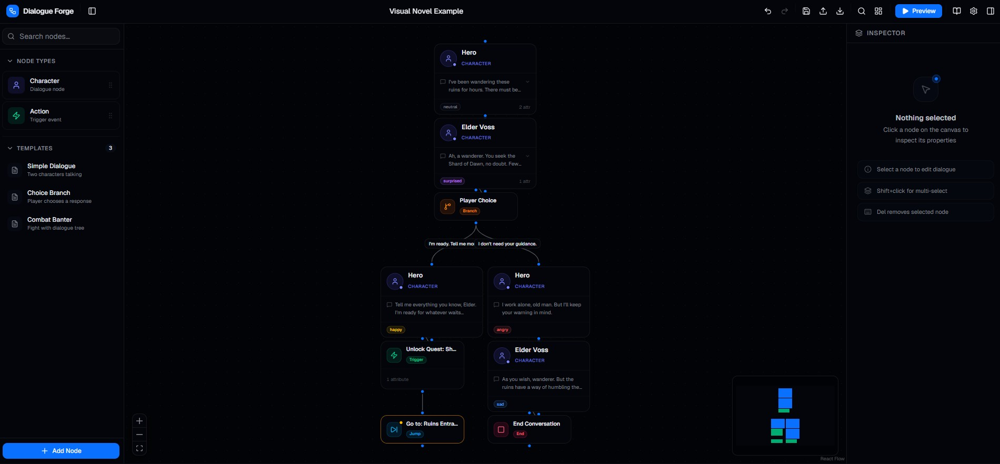

# Dialogue Forge


Dialogue Forge is a visual dialogue editor for games, RPGs, visual novels, and interactive stories.

Build conversations as graphs, preview every branch directly in the editor, then export structured JSON ready for your runtime.

<p align="center">
  
</p>

🌐 Demo: https://dialogue-forge.nikatopu.dev/

---

## Features

### Build dialogue visually

Create conversations using a node-based editor:

- **Start nodes** — dialogue entry points and independent story branches
- **Character nodes** — dialogue, emotions, portraits, and metadata
- **Action nodes** — Branch / Trigger / Jump / End

Editor features include:

- Drag & drop graph editing
- Auto layout (`Ctrl + L`)
- Search (`Ctrl + F`)
- Multi-select editing
- Copy / paste subgraphs
- Undo / redo history
- Live validation
- Import / Export

---

### Build game flows, not just dialogue

Dialogue Forge supports more than linear conversations.

Create:

- Main story flows
- NPC conversations
- Shops
- Combat encounters
- Tutorials
- Quest chains

Multiple **Start nodes** allow one project to contain several dialogue systems.

Example:

```text
START Main Story

START Merchant

START Combat

START Tutorial
```

Each entry becomes selectable during preview and automatically organized into its own graph cluster.

---

### Runtime events

Trigger nodes support structured runtime events.

Categories:

- Game
- Variables
- Audio
- Animation
- UI
- Custom

Examples:

```text
PlayMusic → battle_theme

QuestStarted → main_story

OpenInventory
```

Events support execution timing:

⚡ Immediate

→ Before Next Node

✓ After Next Node

Allowing runtime chains like:

```text
Dialogue
→ Play music

Dialogue
→ Start quest

Dialogue
→ Trigger cutscene
```

---

### Preview before exporting

Preview conversations directly inside the editor.

Supports:

- Entry selection
- Branch traversal
- Trigger visualization
- Event timing
- Jump flows
- Branch switching

No exporting required just to test dialogue.

---

### Templates included

Built-in templates:

- Simple Dialogue
- Choice Branch
- Combat Banter
- Multi Branch Story
- Combat Encounter
- Quest System
- Shop System

Templates act as examples and onboarding projects.

---

### Mobile ready

Dialogue Forge works on desktop, tablet, and mobile.

Features include:

- Touch-friendly graph editing
- Pinch zoom
- Mobile inspector sheets
- Floating actions
- Responsive preview
- Touch gestures

Build dialogue anywhere.

---

### Import / Export

Projects export as:

```text
.forge.json
```

Export runtime-ready dialogue graphs and load them again anytime.

Older projects remain compatible across updates.

---

## Tech Stack

Dialogue Forge is built around a modern frontend stack focused on visual editing and interactivity.

| Layer        | Technology              |
| ------------ | ----------------------- |
| Framework    | Next.js 16 (App Router) |
| Language     | TypeScript 5            |
| Styling      | Tailwind CSS v4         |
| Components   | shadcn/ui               |
| Graph Engine | React Flow v12          |
| State        | Zustand                 |
| Animation    | Framer Motion           |
| Validation   | Zod                     |
| Icons        | Lucide                  |

---

## Getting Started

Clone the project and start the editor locally.

```bash
npm install
npm run dev
```

Open:

```text
http://localhost:3000
```

Load a template or demo project to start immediately.

---

## Keyboard Shortcuts

| Shortcut     | Action           |
| ------------ | ---------------- |
| Ctrl + Z     | Undo             |
| Ctrl + Y     | Redo             |
| Ctrl + D     | Duplicate node   |
| Ctrl + C     | Copy selection   |
| Ctrl + V     | Paste            |
| Ctrl + F     | Search           |
| Ctrl + L     | Auto layout      |
| Ctrl + S     | Export JSON      |
| Del          | Delete           |
| Esc          | Close / Deselect |
| Space + Drag | Pan              |
| Shift        | Multi-select     |

---

## Export Format

Example:

```jsonc
{
  "version": 1,

  "nodes": [
    {
      "id": "start-main",

      "type": "start",

      "data": {
        "name": "Main Story",
      },
    },

    {
      "id": "hero",

      "type": "character",

      "data": {
        "name": "Hero",

        "dialogue": "We finally arrived.",

        "emotion": "happy",
      },
    },

    {
      "id": "trigger-1",

      "type": "action",

      "data": {
        "actionType": "trigger",

        "category": "audio",

        "event": "PlayMusic",

        "executionMode": "beforeNext",

        "params": {
          "track": "battle_theme",
        },
      },
    },
  ],
}
```

---

## Runtime Quick Start

```ts
import graph from "./dialogue.forge.json";

const starts = graph.nodes.filter((n) => n.type === "start");

const entry = starts.find((n) => n.data.name === "Main Story") ?? starts[0];

runDialogue(entry);
```

See `/how-to-use` for:

- TypeScript runtime integration
- Unity C#
- Godot
- Unreal
- Runtime traversal examples

---

## Project Structure

```text
app/
components/
store/
hooks/
lib/
types/
schemas/
```

Main areas:

```text
graph/
nodes/
preview/
validation/
inspector/
layout/
```

---

## Browser Storage

Dialogue Forge automatically saves locally.

Keys:

```text
dialogue-forge-graph
dialogue-forge-ui
```

Closing the browser restores the previous session automatically.

Use:

```text
Ctrl + S
```

to export portable copies outside the browser.

---

Built with Next.js, TypeScript, React Flow, and lots of graph logic.
