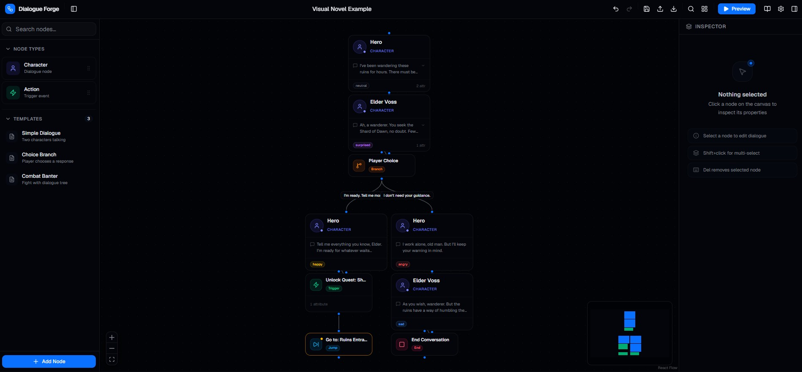

<div align="center">

<br />

```
██████╗ ██╗ █████╗ ██╗      ██████╗  ██████╗ ██╗   ██╗███████╗
██╔══██╗██║██╔══██╗██║     ██╔═══██╗██╔════╝ ██║   ██║██╔════╝
██║  ██║██║███████║██║     ██║   ██║██║  ███╗██║   ██║█████╗  
██║  ██║██║██╔══██║██║     ██║   ██║██║   ██║██║   ██║██╔══╝  
██████╔╝██║██║  ██║███████╗╚██████╔╝╚██████╔╝╚██████╔╝███████╗
╚═════╝ ╚═╝╚═╝  ╚═╝╚══════╝ ╚═════╝  ╚═════╝  ╚═════╝ ╚══════╝

        ███████╗ ██████╗ ██████╗  ██████╗ ███████╗            
        ██╔════╝██╔═══██╗██╔══██╗██╔════╝ ██╔════╝            
        █████╗  ██║   ██║██████╔╝██║  ███╗█████╗              
        ██╔══╝  ██║   ██║██╔══██╗██║   ██║██╔══╝              
        ██║     ╚██████╔╝██║  ██║╚██████╔╝███████╗            
        ╚═╝      ╚═════╝ ╚═╝  ╚═╝ ╚═════╝ ╚══════╝            
```

**Build branching dialogue the way stories actually work: visually, node by node.**

<br />

[](https://nextjs.org)
[](https://www.typescriptlang.org)
[](https://reactflow.dev)
[](https://supabase.com)
[](https://github.com/nikatopu/dialogue-forge/releases)
[](./LICENSE)

<br />

[**Live Demo**](https://dialogueforge.org) · [**Roadmap**](https://dialogueforge.org/roadmap) · [**How to Use**](https://dialogueforge.org/how-to-use) · [**Support**](https://dialogueforge.org/support) · [**Report a Bug**](https://github.com/nikatopu/dialogue-forge/issues)

<br />

</div>

<p align="center">
  
</p>

<br />

---

<br />

## What is Dialogue Forge?

Dialogue Forge is a **visual branching dialogue editor** built for game developers, narrative designers, and interactive fiction writers. Design complex conversation graphs with a drag-and-drop canvas, preview every branch without leaving the editor, and export structured JSON ready for Unity, Godot, Unreal, or any custom runtime.

No code required to design. No guesswork required to preview. No friction between idea and export.

<br />

---

<br />

## Feature Overview

<br />

### Node-Based Visual Editing

Conversations are graphs. Dialogue Forge treats them that way.

| Node          | Purpose                                                    |
| ------------- | ---------------------------------------------------------- |
| **Start**     | Entry points — one per story branch, quest, NPC, or scene  |
| **Character** | Speaker line with name, emotion, portrait, and metadata    |
| **Action**    | Branch choices, Jump links, Trigger events, or End markers |

Every connection is a potential story path. Every branch is a traversable flow.

<br />

### The Full Editor Toolkit

```
Drag & drop canvas      Auto layout (Ctrl+L)      Live validation
Search nodes (Ctrl+F)   Copy / paste subgraphs    Undo / redo history
Multi-select editing    Import / Export JSON       Context menus
```

<br />

### Multi-Entry Narratives

A single project can hold your entire game's dialogue. Each `START` node becomes its own independent flow:

```
┌─────────────────┐   ┌─────────────────┐   ┌─────────────────┐
│  START MainStory│   │  START Merchant │   │  START Tutorial │
│  ─────────────  │   │  ─────────────  │   │  ─────────────  │
│  Chapter 1...   │   │  Welcome to...  │   │  Press WASD...  │
└────────┬────────┘   └────────┬────────┘   └────────┬────────┘
         │                     │                     │
        ...                   ...                   ...
```

Each entry runs its own preview flow. All live inside one `.forge.json` file.

<br />

### Runtime Event System

A Trigger node does exactly one thing: **emit a single named event** to your game engine, then auto-advance.

There is no fixed catalogue to pick from — you name the event, and Dialogue Forge passes it through untouched. Whatever your runtime already listens for is a valid event name.

| Field              | Purpose                                                        |
| ------------------ | -------------------------------------------------------------- |
| **Event Name**     | The identifier your engine handles — `QuestStarted`, `PlayMusic` |
| **Parameters**     | Optional flat `key=value` payload — string values, parsed by your runtime |
| **Execution Mode** | When it fires: Immediate · Before Next · After Next             |

```json
{
  "actionType": "trigger",
  "label": "Unlock Quest",
  "event": "QuestStarted",
  "params": { "questId": "shard_of_dawn" },
  "executionMode": "afterNext"
}
```

Anything that changes project state belongs on a **Set Variable** node instead — triggers only talk outward to your runtime.

<br />

### In-Editor Preview

Test every branch without leaving Dialogue Forge.

- Select any entry point and walk through the entire flow
- Traverse all branch choices interactively
- Inspect trigger event names, parameters, and execution timing
- Follow Jump links across the graph
- Switch between branches mid-preview

Ship dialogue you've actually seen play out.

<br />

---

<br />

## Cloud Workspace

Work locally, sync globally — or stay local forever. Your choice.

```
Without an account          With an account (free)
────────────────────        ──────────────────────────────
✓ Full editor               ✓ Everything local, plus:
✓ Unlimited local files     ✓ Cloud autosave
✓ Import / Export           ✓ Up to 5 cloud projects
✓ All templates             ✓ Access from any device
✓ All themes                ✓ Local → cloud migration
                            ✓ Autosave status indicator
```

Sign in with **Google** or **GitHub**. Guests are never blocked.

<br />

---

<br />

## Production Templates

Start fast with templates built for real game scenarios.

| Template           | Description                                      |
| ------------------ | ------------------------------------------------ |
| NPC Conversation   | Greeting + multi-branch player responses         |
| Quest Giver        | Accept / decline with follow-up flows            |
| Merchant           | Shop greeting, haggle, and farewell paths        |
| Combat Encounter   | Pre-battle dialogue with outcome branches        |
| Companion Dialogue | Relationship tier system with emotional paths    |
| Tutorial Sequence  | Step-by-step guided onboarding flow              |
| Cutscene           | Cinematic narrative with timed triggers          |
| Multi-Entry RPG    | Full project starter with multiple story threads |

**Insert mode** — append a template into your existing graph without losing any work. IDs are remapped automatically.

**Replace mode** — load a template as a fresh workspace.

<br />

---

<br />

## Themes

Six dark variants. One accent color per theme, applied across every panel, node, badge, and graph element.

```
  ● Default    —  Indigo    #6366f1
  ● Ocean      —  Cyan      #06b6d4
  ● Forest     —  Green     #16a34a
  ● Midnight   —  Violet    #7c3aed
  ● Rose       —  Pink      #f43f5e
  ● Cyber      —  Lime      #84cc16
```

Preferences persist across sessions and sync to cloud accounts.

<br />

---

<br />

## Mobile & Tablet

Dialogue Forge is fully responsive and touch-first.

- Pinch to zoom the canvas
- Bottom sheets for node creation and inspection
- Floating action buttons
- Full preview on mobile
- Tablet layout with adaptive panels

Design dialogue on the train. Finish it at your desk.

<br />

---

<br />

## Tech Stack

```
Framework      Next.js 16         App Router, server + client components
Language       TypeScript 5       Strict, end-to-end typed
Styling        Tailwind CSS v4    CSS-first, no config file
Components     shadcn/ui          Radix primitives + custom design system
Graph Engine   React Flow v12     Nodes, edges, handles, minimap
State          Zustand            Persist middleware, per-slice stores
Animation      Framer Motion      Panel transitions, presence animations
Validation     Zod                Runtime schema validation
Icons          Lucide             Consistent icon set
Auth / DB      Supabase           Auth, Postgres, realtime, storage
Analytics      PostHog (EU)       Cookieless activation funnel, DNT-aware
```

<br />

---

<br />

## Getting Started

**1. Install and run**

```bash
git clone https://github.com/nikatopu/dialogue-forge.git
cd dialogue-forge
npm install
npm run dev
```

**2. Open the app**

```
http://localhost:3000            Landing page
http://localhost:3000/editor     The editor
http://localhost:3000/dev/analytics   Event capture view (dev only)
```

Returning users can skip the landing page entirely via **Settings → General → Skip the landing page**; `/?stay=1` reaches it again either way.

**3. Pick a template or start blank**

Load one of the built-in templates from the toolbar to hit the ground running, or start with an empty canvas.

<br />

---

<br />

## Cloud Setup (Optional)

The editor works fully offline without any credentials. To enable cloud sync:

**1. Copy the environment template**

```bash
cp .env.local.example .env.local
```

**2. Add your Supabase credentials**

```env
NEXT_PUBLIC_SUPABASE_URL=your_project_url
NEXT_PUBLIC_SUPABASE_ANON_KEY=your_anon_key
```

**3. Run the database schema**

```
lib/supabase/schema.sql
```

**4. Enable OAuth providers in Supabase**

- Authentication → Providers → Google
- Authentication → Providers → GitHub

<br />

---

<br />

## Keyboard Shortcuts

| Shortcut       | Action           |
| -------------- | ---------------- |
| `Ctrl + Z`     | Undo             |
| `Ctrl + Y`     | Redo             |
| `Ctrl + D`     | Duplicate node   |
| `Ctrl + C`     | Copy node        |
| `Ctrl + V`     | Paste node       |
| `Ctrl + F`     | Search nodes     |
| `Ctrl + L`     | Auto layout      |
| `Ctrl + S`     | Export JSON      |
| `Del`          | Delete selected  |
| `Esc`          | Deselect / close |
| `Space + Drag` | Pan canvas       |
| `Shift`        | Multi-select     |

<br />

---

<br />

## Project Structure

```
dialogue-forge/
├── app/
│   ├── page.tsx              # Marketing landing page
│   ├── editor/               # The editor itself
│   ├── projects/             # Cloud project dashboard
│   ├── dev/analytics/        # Event capture view (development only)
│   ├── roadmap/              # Public roadmap
│   ├── how-to-use/           # Documentation
│   ├── auth/                 # Auth callback
│   ├── privacy/              # Privacy policy
│   └── terms/                # Terms of service
│
├── components/
│   ├── nodes/                # Character, Action, Start node UIs
│   ├── layout/               # TopBar, Sidebar, EditorLayout
│   ├── settings/             # SettingsPanel (fullscreen)
│   ├── auth/                 # SignInModal
│   ├── dashboard/            # ProjectCard, DashboardPage
│   ├── modals/               # ConfirmModal, TemplateActionModal
│   └── preview/              # In-editor preview player
│
├── store/
│   ├── useGraphStore.ts      # Nodes, edges, undo/redo
│   ├── useEditorStore.ts     # UI state, theme, project ID
│   └── useProjectStore.ts    # Cloud projects, auth user
│
└── lib/
    ├── analytics.ts          # Typed activation-funnel wrapper (track)
    ├── analytics/            # Identity, attribution, transport, dev capture
    ├── supabase/             # Client, server, schema, types
    ├── templates.ts          # Built-in template definitions
    ├── exportGraph.ts        # Serialization + JSON download
    ├── roadmap.ts            # Roadmap data
    └── applyTheme.ts         # DOM theme application
```

<br />

---

<br />

## Local Storage

Dialogue Forge autosaves to the browser on every change.

```
dialogue-forge-graph          →  All nodes and edges
dialogue-forge-ui             →  Theme, sidebar state, project name
dialogue-forge-launch-mode    →  Whether / opens the landing page or the editor
dialogue-forge-aid            →  Random anonymous analytics ID
dialogue-forge-attribution    →  First-touch UTM parameters
dialogue-forge-visits         →  Visit timestamps behind return_visit
dialogue-forge-analytics-*    →  Which funnel milestones have fired
```

Closing and reopening the browser restores your last session exactly. Use `Ctrl + S` to export a portable `.forge.json` backup.

<br />

---

<br />

## Product Analytics

Dialogue Forge tracks a single **activation funnel** — how far a new visitor gets, from landing on the site to exporting a file they can use. It is deliberately small: eight events, no page-by-page tracking, and nothing that could carry a person's writing.

### How it works

[PostHog](https://posthog.com) (EU-hosted) is the sink, wrapped by a typed façade at [`lib/analytics.ts`](lib/analytics.ts). Product code only ever calls `track()`:

```ts
import { track } from "@/lib/analytics";

track("export_clicked", { engine: "json", trigger: "menu", node_count: 12 });
```

Event names come from the `AnalyticsEventName` union and props are typed per event, so an unknown event name or a misspelled prop is a compile error rather than a silent gap in a dashboard.

This runs **alongside** the older consent-gated Google Analytics / Clarity setup in [`lib/analytics/analyticsService.ts`](lib/analytics/analyticsService.ts), which still owns its own broader event catalogue. The two are independent; new funnel work belongs in `lib/analytics.ts`.

### Privacy properties

| Property | How it is enforced |
| --- | --- |
| **Cookieless** | PostHog runs with `persistence: "localStorage"`. Nothing is written to `document.cookie`, so the cookie banner does not gate it. |
| **Do-Not-Track honoured** | DNT and Global Privacy Control are both checked before the SDK is imported. If either is set, the script is never downloaded. |
| **Production only** | The transport requires `NEXT_PUBLIC_ANALYTICS_KEY` **and** a production build. Set `NEXT_PUBLIC_ANALYTICS_DEBUG=1` to override locally. |
| **No PII** | Props are typed as counts and fixed enums, then sanitised again at runtime: keys matching `email`, `name`, `dialogue`, `text`, `content`, … are dropped, as are non-primitives and strings over 64 characters. |
| **No IP, no geo** | `$ip` is nulled in a `before_send` hook and sits in the `property_denylist`. |
| **No autocapture** | Autocapture, session recording, surveys and automatic pageviews are all off — autocapture in particular would collect the text of clicked elements, which here is the user's dialogue. |
| **Anonymous identity** | A random UUID in `localStorage` (`dialogue-forge-aid`). No `identify()` call is ever made, so the profile is never linked to an account. |

### The eight events

| Event | Fires when | Where | Props |
| --- | --- | --- | --- |
| `landing_view` | The marketing page at `/` mounts. | [`LandingPage/useLandingTracking.ts`](components/organisms/LandingPage/useLandingTracking.ts) | `referrer_host?` — host of the referring site, omitted for direct traffic<br />`skipped_to_editor` — whether this visitor is being redirected straight to `/editor` |
| `demo_loaded` | The editor is reached for the first time in a session, from `/editor` or a cloud project. Once per session. | [`EditorLayout/useActivationTracking.ts`](components/organisms/EditorLayout/useActivationTracking.ts) | `surface` — `"local"` or `"cloud"`<br />`node_count` — nodes already on the canvas |
| `project_created` | A new, non-demo graph is started. Loading the demo project never fires it. | Cloud: [`store/useProjectStore.ts`](store/useProjectStore.ts) · Import: [`TopBar/useTopBarActions.ts`](components/organisms/TopBar/useTopBarActions.ts) · Local: [`lib/analytics/funnel.ts`](lib/analytics/funnel.ts) | `source` — `"cloud"`, `"local"` or `"import"` |
| `first_node_added` | The visitor's very first node, on any project. Once per visitor, ever. | [`lib/analytics/funnel.ts`](lib/analytics/funnel.ts), called from the canvas drop handler and the mobile node sheet | `node_type` — `"character"`, `"action"` or `"start"` |
| `first_branch_created` | A Branch action node first has **two or more** outgoing edges. Derived from the graph, so a drag, a paste, an undo or an import all count. Once per visitor, ever. | [`EditorLayout/useActivationTracking.ts`](components/organisms/EditorLayout/useActivationTracking.ts) via `widestBranch()` | `outgoing_edges` — choices on the branch when it qualified |
| `preview_run` | The in-editor preview is opened. | [`TopBar`](components/organisms/TopBar/index.tsx) and [`MobileToolbar`](components/organisms/MobileToolbar/index.tsx) | `surface` — `"toolbar"` or `"mobile"`<br />`node_count` |
| `export_clicked` | A JSON export is triggered. | [`TopBar/useTopBarActions.ts`](components/organisms/TopBar/useTopBarActions.ts) | `engine` — always `"json"` today; the prop exists so the shape survives engine-specific exports<br />`trigger` — `"menu"` or `"toolbar_save"`<br />`node_count` |
| `return_visit` | A page load starts a new session (30+ minutes since the last activity) for a visitor who has been here before. | [`lib/analytics.ts`](lib/analytics.ts) → `initAnalytics()` | `days_since_last` — whole days since the previous session<br />`visit_count` — 2 on the first return |

### Attribution

On the first visit that carries them, `utm_source`, `utm_medium`, `utm_campaign`, `utm_term`, `utm_content` and the referring **host** are frozen into `localStorage` and attached to the anonymous profile with `$set_once`. Later visits never overwrite them, so a funnel answers "which campaign produced activated users", not "which link did they click most recently". Nothing else in the query string is read.

### Verifying it locally

Every `track()` call is recorded in the browser regardless of whether a transport is live, and rendered at **`/dev/analytics`** (development builds only; the route 404s in production).

```bash
npm run dev
# open http://localhost:3000/dev/analytics
```

The page shows transport status, the anonymous ID, stored attribution, a checklist of all eight events with instructions for triggering each, and a live log of everything captured. **Reset funnel state** clears the milestones, visit history and anonymous ID so the whole funnel can be walked again from scratch.

To exercise attribution, open the landing page as `/?utm_source=test&utm_campaign=demo` in a fresh browser profile.

### Configuration

```bash
NEXT_PUBLIC_ANALYTICS_KEY=phc_...              # required; unset means nothing loads
NEXT_PUBLIC_ANALYTICS_HOST=https://eu.i.posthog.com   # optional, defaults to PostHog EU
NEXT_PUBLIC_ANALYTICS_DEBUG=1                  # optional, loads the SDK outside production
```

<br />

---

<br />

## Variables & Conditions

### Variable Types

Declare variables in the Variables panel to represent gameplay state that your dialogue can read and react to.

| Type      | Description                        | Example Default         |
| --------- | ---------------------------------- | ----------------------- |
| `number`  | Integer value                      | `42`                    |
| `float`   | Decimal number                     | `3.14`                  |
| `boolean` | True/false flag                    | `true`                  |
| `string`  | Text value                         | `"Hero"`                |
| `list`    | Array of strings                   | `["sword", "shield"]`   |
| `object`  | Key-value pairs                    | `{"level": 5}`          |

<br />

### Dialogue Interpolation

Reference variables directly in Character node dialogue using `{variableName}` syntax:

- `{playerName}` — inserts the value of the `playerName` variable
- `{stats.level}` — traverses into an object variable's `level` property
- `{inventory.length}` — shows the number of items in a list variable

Tokens are replaced at preview/runtime — the stored dialogue text stays raw.
Type `{` in the dialogue editor to trigger autocomplete, or use the **Insert Variable** button.

<br />

### Conditions

Attach conditions to edges to gate which paths are available. An edge is traversable only when all conditions evaluate to `true`.

**Number & Float**

| Operator                          | Description                            |
| --------------------------------- | -------------------------------------- |
| `equals` / `notEquals`            | Exact match or mismatch                |
| `greaterThan` / `lessThan`        | Exclusive comparison                   |
| `greaterThanOrEqual` / `lessThanOrEqual` | Inclusive comparison            |
| `between` / `notBetween`          | Inclusive range check                  |

**Boolean**

| Operator  | Description          |
| --------- | -------------------- |
| `isTrue`  | Variable is true     |
| `isFalse` | Variable is false    |

**String**

| Operator                     | Description             |
| ---------------------------- | ----------------------- |
| `equals` / `notEquals`       | Case-sensitive match    |
| `contains` / `notContains`   | Substring presence      |
| `startsWith` / `endsWith`    | Prefix or suffix        |
| `isEmpty` / `isNotEmpty`     | Blank string check      |

**List**

| Operator                         | Description                              |
| -------------------------------- | ---------------------------------------- |
| `listContains`                   | List includes a specific string value    |
| `listIsEmpty` / `listIsNotEmpty` | Zero-length check on the list            |

**Object**

| Operator         | Description                         |
| ---------------- | ----------------------------------- |
| `hasProperty`    | Object has a given key              |
| `hasNoProperty`  | Object does not have a given key    |

<br />

---

<br />

## Roadmap

Dialogue Forge is growing into a full **narrative workflow platform**.

```
v1.4  Gameplay State System    Variables, conditions, conditional branches
v1.5  Narrative Database       Character library, portraits, voice metadata
v1.6  Quest & Scene Systems    Quest graphs, timeline view, story chapters
v1.7  Collaboration            Shared projects, comments, review mode
v1.8  Runtime Ecosystem        Unity SDK, Godot plugin, React player
v1.9  Analytics & QA           Path analysis, validation reports, heatmaps
v2.0  AI Narrative Assistant   Dialogue generation, tone rewriting, localization
```

Full details at [dialogueforge.org/roadmap](https://dialogueforge.org/roadmap)

<br />

---

<br />

<div align="center">

Built with Next.js, TypeScript, React Flow, Supabase, and a lot of graph logic.

**If Dialogue Forge saves you time, a star on GitHub means a lot.**

[**Star on GitHub**](https://github.com/nikatopu/dialogue-forge) · [**Report an Issue**](https://github.com/nikatopu/dialogue-forge/issues) · [**nikatopu@gmail.com**](mailto:nikatopu@gmail.com)

<br />

</div>
